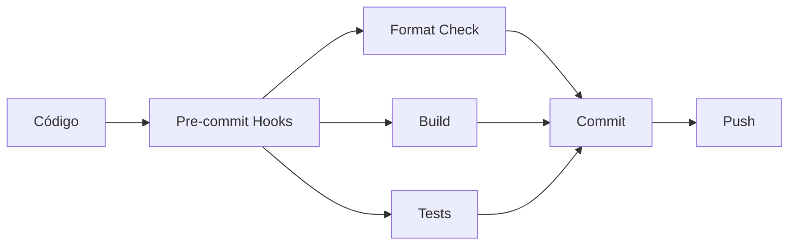

# MinIO Integration with .NET

Este projeto demonstra a integração do .NET com MinIO, incluindo operações de upload, download e gerenciamento de objetos em storage S3-compatible.

## 🚀 Tecnologias

- **.NET 9.0** - Framework principal
- **MinIO** - Object storage S3-compatible
- **ASP.NET Core** - Web API
- **Swagger/OpenAPI** - Documentação da API
- **CSharpier** - Formatação de código
- **Pre-commit** - Hooks de qualidade de código

## 📋 Pré-requisitos

- [.NET 9.0 SDK](https://dotnet.microsoft.com/download/dotnet/9.0)
- [Python 3.8+](https://www.python.org/downloads/) (para pre-commit)
- [Docker](https://www.docker.com/) (opcional, para MinIO local)
- [Git](https://git-scm.com/)

## 🛠️ Configuração do Ambiente

### 1. Configuração Rápida

```powershell
# Clone o repositório
git clone <repository-url>
cd minio_integrations

# Configure o ambiente de desenvolvimento
.\build.ps1 setup-dev
```

### 2. Configuração Manual

```powershell
# Instale as dependências
.\build.ps1 install

# Ou manualmente:
dotnet tool restore
dotnet restore
pre-commit install
```

## 🔧 Comandos Disponíveis

O projeto inclui um script PowerShell (`build.ps1`) com os seguintes comandos:

```powershell
# Ajuda
.\build.ps1 help

# Configuração inicial
.\build.ps1 setup-dev

# Formatar código
.\build.ps1 format

# Verificar formatação
.\build.ps1 check

# Compilar projeto
.\build.ps1 build

# Executar testes
.\build.ps1 test

# Executar pre-commit hooks
.\build.ps1 pre-commit

# Pipeline completo de CI
.\build.ps1 ci
```

## 🎯 Pre-commit Hooks

O projeto está configurado com hooks de pre-commit que executam automaticamente antes de cada commit:

### Hooks Configurados

1. **Restore .NET tools** - Restaura ferramentas necessárias
2. **Format C# files** - Formata código com CSharpier
3. **Check C# formatting** - Verifica se o código está formatado
4. **Restore packages** - Restaura pacotes NuGet
5. **Build solution** - Compila o projeto
6. **Quality checks** - Verifica espaços em branco, final de linha, etc.
7. **Security scan** - Detecta possíveis segredos no código

### Executar Manualmente

```powershell
# Executar todos os hooks
pre-commit run --all-files

# Executar hook específico
pre-commit run csharpier-format

# Pular hooks temporariamente
git commit --no-verify -m "commit message"
```

## 🏗️ Estrutura do Projeto

```text
├── src/
│   ├── MinioDotnet/              # Projeto principal (Web API)
│   │   ├── Program.cs
│   │   ├── appsettings.json
│   │   └── MinioDotnet.csproj
│   └── MinioDotnet.Services/     # Biblioteca de serviços
│       ├── Services/
│       ├── Interfaces/
│       └── MinioExtensions.cs
├── .config/
│   └── dotnet-tools.json         # Ferramentas .NET (CSharpier, Husky)
├── .husky/                       # Configuração Husky.Net (legado)
├── .pre-commit-config.yaml       # Configuração pre-commit
├── .csharpierrc.json            # Configuração CSharpier
├── build.ps1                    # Script de automação
├── Makefile                     # Makefile para ambientes Unix
└── docker-compose.yml           # MinIO local
```

## 🐳 MinIO Local

Para desenvolvimento local, use Docker Compose:

```powershell
# Iniciar MinIO
docker-compose up -d

# MinIO Console: http://localhost:9001
# Usuário: minioadmin
# Senha: minioadmin
```

## 🧪 Testes

```powershell
# Executar todos os testes
.\build.ps1 test

# Ou diretamente com dotnet
dotnet test --configuration Release --verbosity normal
```

## 📚 API Documentation

Com o projeto em execução, acesse:

- **Swagger UI**: <http://localhost:5000/swagger>
- **ReDoc**: <http://localhost:5000/redoc>

## 🔄 Workflow de Desenvolvimento



1. **Escreva o código**
2. **Stage as mudanças**: `git add .`
3. **Commit**: `git commit -m "message"`
   - Os hooks executam automaticamente
   - Formata o código
   - Verifica compilação
   - Executa testes
4. **Push**: `git push`

## 🚨 Solução de Problemas

### Pre-commit falhando

```powershell
# Reinstalar hooks
pre-commit uninstall
pre-commit install

# Atualizar hooks
pre-commit autoupdate

# Limpar cache
pre-commit clean
```

### Formatação CSharpier

```powershell
# Formatar manualmente
dotnet csharpier format .

# Verificar formatação
dotnet csharpier check .
```

### Build falhando

```powershell
# Limpar e reconstruir
.\build.ps1 clean
.\build.ps1 restore
.\build.ps1 build
```

## 📄 Configuração do CSharpier

A formatação segue as configurações em `.csharpierrc.json`:

```json
{
  "printWidth": 100,
  "useTabs": false,
  "tabWidth": 4,
  "endOfLine": "crlf"
}
```

## 🤝 Contribuindo

1. Fork o projeto
2. Crie uma branch: `git checkout -b feature/nova-feature`
3. Faça as mudanças (os hooks garantem a qualidade)
4. Commit: `git commit -m "Add nova feature"`
5. Push: `git push origin feature/nova-feature`
6. Abra um Pull Request

## 📝 License

Este projeto está sob a licença MIT. Veja o arquivo [LICENSE](LICENSE.txt) para mais detalhes.
